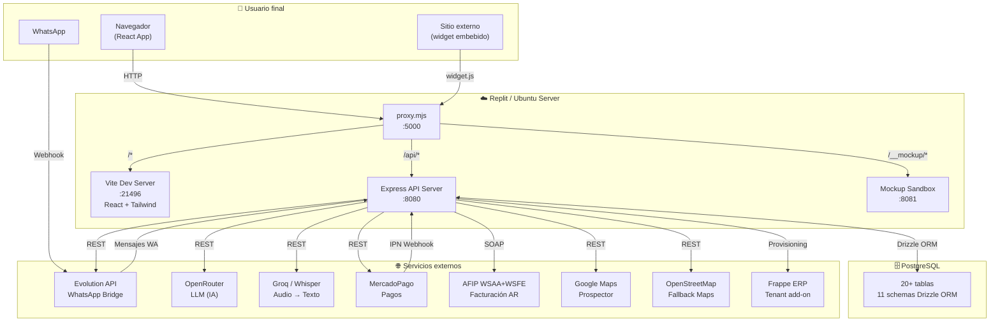
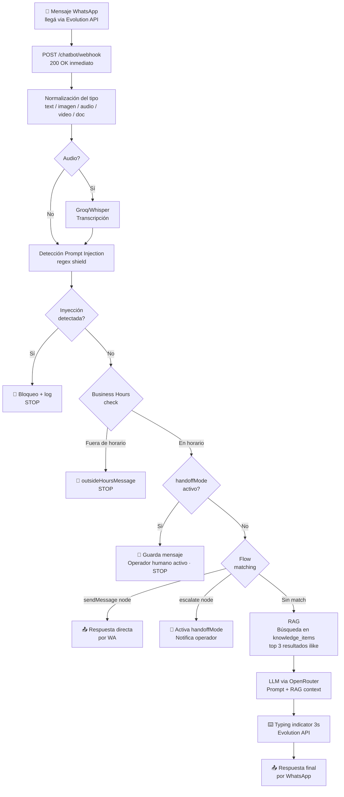
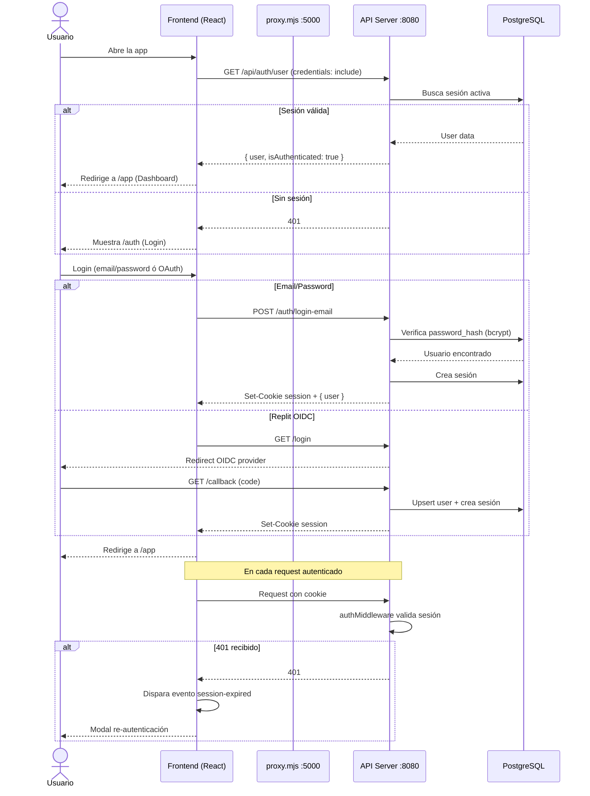
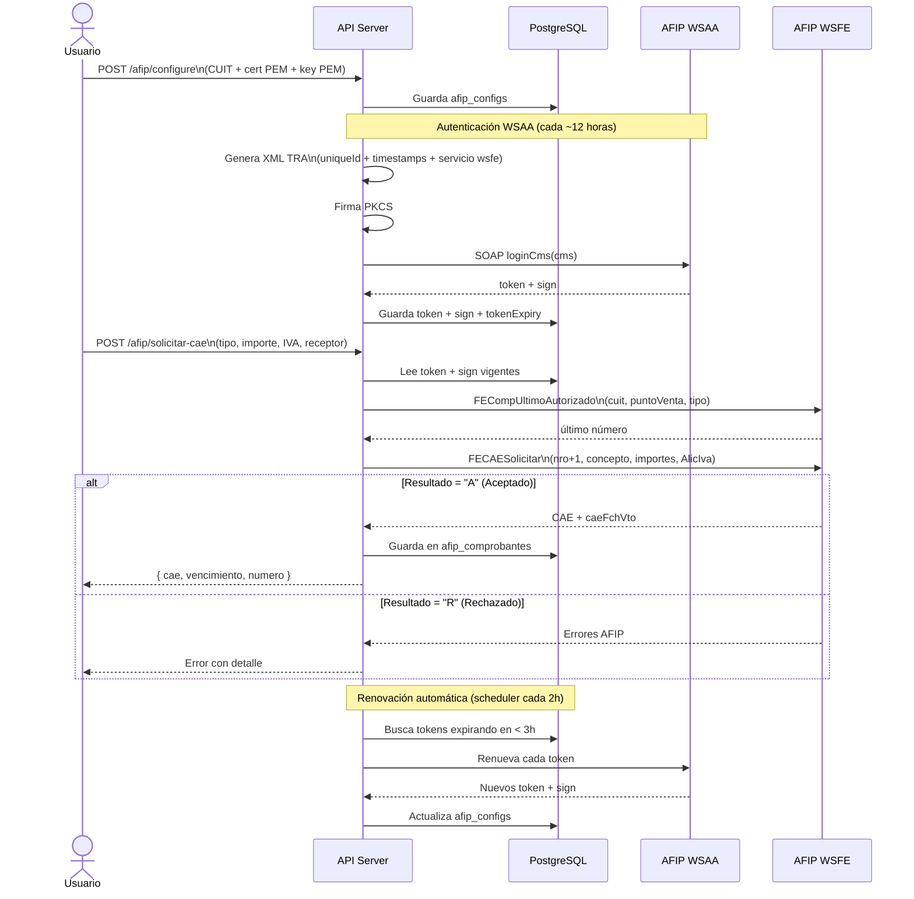
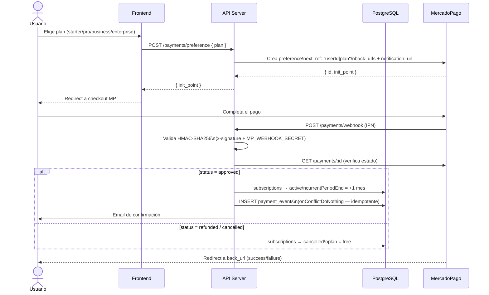
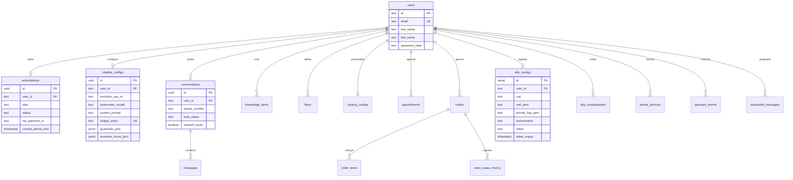
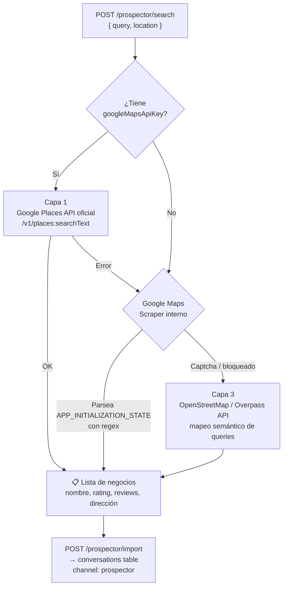

# Clientum — Arquitectura Completa del Proyecto

> Documentación generada a partir del análisis exhaustivo del codebase. Fecha: Junio 2026.

---

## Índice

1. [Visión general](#1-visión-general)
2. [Diagramas de flujo](#2-diagramas-de-flujo)
3. [Estructura del monorepo](#3-estructura-del-monorepo)
4. [Base de datos](#4-base-de-datos)
5. [Backend — API Server](#5-backend--api-server)
6. [Frontend — Clientum](#6-frontend--clientum)
7. [Pipeline de código auto-generado](#7-pipeline-de-código-auto-generado)
8. [Módulos complejos en detalle](#8-módulos-complejos-en-detalle)
9. [Infraestructura y deploy](#9-infraestructura-y-deploy)
10. [Variables de entorno](#10-variables-de-entorno)
11. [Scripts de administración](#11-scripts-de-administración)
12. [Resumen de complejidad](#12-resumen-de-complejidad)

---

## 1. Visión general

**Clientum** es un SaaS de automatización con IA orientado a PyMEs argentinas. Permite configurar un agente de IA conectado a WhatsApp que gestiona leads, responde consultas, emite facturas AFIP y administra turnos — todo desde un dashboard unificado.

### Stack tecnológico

| Capa | Tecnología |
|---|---|
| Frontend | React 19, Vite 7, Tailwind CSS v4, Shadcn/UI, Framer Motion, Wouter |
| Backend | Express 5, Node.js, ESBuild |
| Base de datos | PostgreSQL + Drizzle ORM |
| IA | OpenRouter (LLM), Groq/Whisper (audio → texto) |
| WhatsApp | Evolution API |
| Pagos | MercadoPago |
| Fiscal AR | AFIP WSAA + WSFE (node-forge PKCS#7) |
| Auth | Replit OIDC, Google OAuth, Email/Password |
| Protocolo IA externo | Model Context Protocol (MCP over SSE) |
| ERP add-on | Frappe ERP (provisioning por tenant) |

### Flujo de arranque

```
start.sh
  1. pnpm install
  2. pnpm --filter @workspace/db run push     ← Sync schema al DB
  3. pnpm --filter @workspace/api-server build ← esbuild → dist/index.mjs
  4. Ejecuta en paralelo:
       API Server    → puerto 8080
       Vite Dev      → puerto 21496
       Mockup Sand.  → puerto 8081
       Proxy         → puerto 5000  ← único punto de entrada

proxy.mjs enruta:
  /api/*       → :8080   (api-server)
  /__mockup/*  → :8081   (mockup-sandbox)
  /*           → :21496  (clientum/vite)
```

---

## 2. Diagramas de flujo

### 2.1 Arquitectura general del sistema



---

### 2.2 Pipeline de procesamiento de mensajes WhatsApp



---

### 2.3 Flujo de autenticación y sesión



---

### 2.4 Flujo de facturación electrónica AFIP



---

### 2.5 Flujo de pagos MercadoPago



---

### 2.6 Pipeline de código auto-generado (OpenAPI → cliente)

```mermaid
flowchart LR
    YAML["packages/api-spec\nopenapi.yaml\n📄 Fuente de verdad"]
    Orval["Orval\nCode Generator"]
    ZOD["packages/api-zod\nZod schemas\nvalidación runtime"]
    RQ["packages/api-client-react\nReact Query hooks\n+ custom-fetch.ts"]
    FE["apps/web\nFrontend React"]
    API["apps/api\nBackend Express"]

    YAML -->|pnpm run codegen| Orval
    Orval -->|client: zod| ZOD
    Orval -->|client: react-query| RQ
    ZOD -->|@workspace/api-zod| API
    RQ -->|@workspace/api-client-react| FE
    ZOD -.->|tipos compartidos| FE
```

---

### 2.7 Relaciones entre tablas de base de datos



---

### 2.8 Schedulers y jobs en background

```mermaid
gantt
    title Jobs en background (frecuencia de ejecución)
    dateFormat HH:mm
    axisFormat %H:%M

    section reminderScheduler
    Envía WhatsApp pendientes         :active, r1, 00:00, 1m
    Envía WhatsApp pendientes         :active, r2, 00:01, 1m
    Envía WhatsApp pendientes         :active, r3, 00:02, 1m

    section healthAlerts
    Chequeo DB + alerta WA            :crit, h1, 00:00, 3m
    Chequeo DB + alerta WA            :crit, h2, 00:03, 3m

    section afipTokenScheduler
    Renueva tokens expirando          :done, a1, 00:00, 120m

    section trialAlerts
    Emails + downgrade expirados      :milestone, t1, 00:00, 360m
```



---

### 2.9 Prospector — Capas de búsqueda de leads



---

### 2.10 Widget embebible — ciclo de vida

```mermaid
sequenceDiagram
    participant S as Sitio externo
    participant W as Widget JS
    participant API as API Server
    participant LLM as OpenRouter

    S->>API: GET /widget/TOKEN/widget.js
    API->>API: Lee chatbot_configs por widgetToken
    API-->>S: JS dinámico (name, color, welcome inyectados)

    S->>W: Ejecuta widget.js
    W->>W: Crea botón flotante + panel chat\nen vanilla JS + CSS-in-JS
    W->>W: Lee sessionId de localStorage\n(o genera uno nuevo)

    loop Conversación
        Note over W: Usuario escribe mensaje
        W->>API: POST /widget/TOKEN/message\n{ message, sessionId }
        API->>API: Determina modelo LLM\nsegún plan del usuario
        API->>API: Carga historial (20 msgs)
        API->>LLM: Completion con contexto
        LLM-->>API: Respuesta generada
        API->>API: Guarda en messages table
        API-->>W: { reply }
        W-->>Note: Muestra respuesta en el chat
    end
```

---

## 3. Estructura del monorepo

```
clientum/
│
├── apps/
│   ├── web/                   React 19 + Vite 7 (landing + dashboard)
│   ├── api/                   Express 5 (API REST, IA, pagos, AFIP)
│   └── mcp/                   MCP Server (Model Context Protocol)
│
├── packages/
│   ├── db/                    Drizzle ORM + schemas PostgreSQL
│   ├── api-spec/              openapi.yaml + orval.config.ts
│   ├── api-zod/               ← auto-generado (Zod schemas)
│   ├── api-client-react/      ← auto-generado (React Query hooks)
│   └── auth-web/replit-auth-web/  OIDC auth hooks compartidos
│
├── scripts/                   Utilidades admin (TypeScript CLI) + deploy Ubuntu
│   ├── src/                   Scripts admin (seed-admin, create-user, etc.)
│   ├── setup/                 Instalación base del servidor
│   ├── whatsapp/              Scripts Evolution API
│   ├── monitoreo/             Health checks + alertas WhatsApp
│   ├── ops/                   Update, rebuild, backup, restore
│   └── db/                    Gestión de base de datos
│
├── deployment/systemd/        Unit files systemd para Ubuntu
├── proxy.mjs                  Router unificador :5000
├── start.sh                   Orquestador de arranque
└── pnpm-workspace.yaml        Definición del monorepo
```

### Workspaces PNPM (`pnpm-workspace.yaml`)

```yaml
packages:
  - apps/*
  - packages/*
  - packages/auth-web/replit-auth-web
  - scripts
```

Todos los paquetes internos se referencian con `workspace:*`.

### Scripts NPM principales

| Package | Script | Comando |
|---|---|---|
| root | `dev` | `bash start.sh` |
| root | `typecheck` | `tsc` (project references) |
| `api-server` | `build` | `node build.mjs` (esbuild) |
| `api-server` | `start` | `node dist/index.mjs` |
| `clientum` | `dev` | `vite --host 0.0.0.0` |
| `clientum` | `build` | `vite build` |
| `db` | `push` | Drizzle push (dev) |
| `db` | `migrate` | Drizzle migrate (prod) |
| `db` | `generate` | Genera migration files |
| `api-spec` | `codegen` | Orval → genera api-zod + api-client-react |

---

## 3. Base de datos

20+ tablas en 11 schemas Drizzle ORM (PostgreSQL).

### `auth.ts` — Autenticación y usuarios

| Tabla | Columnas clave |
|---|---|
| `users` | `id`, `email` (único), `first_name`, `last_name`, `profile_image_url`, `password_hash`, `created_at` |
| `sessions` | `sid` (PK), `sess` (JSONB), `expire` |
| `password_reset_tokens` | `token` (PK), `user_id` → users, `expires_at`, `used` |

### `subscriptions.ts` — Planes y facturación

| Tabla | Columnas clave |
|---|---|
| `subscriptions` | `id`, `user_id` (único), `plan`, `status`, `mp_payment_id`, `mp_preference_id`, `current_period_end`, `cancelled_at` |
| `payment_events` | `id`, `user_id`, `mp_payment_id`, `plan`, `amount`, `status`, `description` |

### `chatbot.ts` — IA y conversaciones

| Tabla | Columnas clave |
|---|---|
| `chatbot_configs` | `user_id` (único), `evolution_api_url/key/instance`, `openrouter_model`, `system_prompt`, `active`, `api_provider`, `agent_mode`, `max_history`, `widget_token` (único), `widget_name/color/welcome`, `guardrails_json`, `business_hours_json`, `google_maps_api_key`, `groq_api_key` |
| `conversations` | `id`, `user_id`, `phone_number`, `contact_name`, `channel`, `lead_status`, `lead_notes`, `handoff_mode`, `last_message_at` |
| `messages` | `id`, `conversation_id` → conversations, `role` (user/assistant), `content` |
| `knowledge_items` | `id`, `user_id`, `title`, `content` (base de conocimiento RAG) |

### `catalog.ts` — Catálogo digital

| Tabla | Columnas clave |
|---|---|
| `catalog_configs` | `user_id` (único), `token`, `brand_name`, `logo_url`, `hero_image`, `catalog_title`, `whatsapp`, `features_json`, `faq_json`, `reseller_json`, `active` |

### `flows.ts` — Automatizaciones

| Tabla | Columnas clave |
|---|---|
| `flows` | `id`, `user_id`, `name`, `active`, `trigger_keywords`, `match_type`, `nodes` (JSONB), `priority`, `triggered_count`, `resolved_count` |

**Estructura de nodos JSONB:**
```typescript
{ type: "sendMessage", content: string }
{ type: "escalate" }
```

### `services.ts` — Servicios por tenant

| Tabla | Columnas clave |
|---|---|
| `tenant_services` | `id`, `user_id`, `service_type`, `status`, `subdomain`, `site_url`, `requested_at`, `provisioned_at` |

### `appointments.ts` — Agenda

| Tabla | Columnas clave |
|---|---|
| `appointments` | `id`, `user_id`, `contact_name`, `contact_phone`, `service_type`, `scheduled_at`, `duration_minutes`, `status`, `reminder_sent` |
| `scheduled_messages` | `id`, `user_id`, `phone_number`, `message`, `scheduled_at`, `sent_at`, `status`, `type` |

### `orders.ts` — Pedidos

| Tabla | Columnas clave |
|---|---|
| `orders` | `id`, `user_id`, `order_number`, `contact_name/phone`, `status`, `total_amount`, `currency`, `channel` |
| `order_items` | `id`, `order_id` → orders, `product_name`, `quantity`, `unit_price`, `total_price`, `metadata` (JSONB) |
| `order_status_history` | `id`, `order_id`, `from_status`, `to_status`, `note` |

### `newsletter.ts`, `afip.ts`, `health-alerts.ts`

| Tabla | Propósito |
|---|---|
| `newsletter_subscribers` | Lista de emails de marketing |
| `afip_configs` | CUIT, certificados PEM, token/sign, environment |
| `afip_comprobantes` | CAE emitidos, tipo, número, importe, fecha |
| `health_alert_logs` | Logs de monitoreo del sistema |

### Migraciones

- Baseline: `packages/db/migrations/0000_premium_iron_man.sql`
- Ejecutadas en producción por `apps/api/src/lib/migrate.ts` al arrancar
- En desarrollo: `pnpm --filter @workspace/db run push`

---

## 4. Backend — API Server

### Middleware stack (`app.ts`)

```
helmet()             → Security headers
enforceHSTS          → HTTPS forzado
compression(6)       → Gzip
pino-http            → Structured logging (JSON)
cookie-parser        → Cookies
express-session      → Session store en PostgreSQL
Rate Limiters:
  generalLimiter     → rutas normales
  authLimiter        → /auth/*
  webhookLimiter     → /chatbot/webhook
  widgetLimiter      → /widget/*
  adminExecLimiter   → /admin/exec
authMiddleware       → OIDC session + in-flight token refresh
```

### Schedulers en background (setInterval al arrancar)

| Job | Frecuencia | Qué hace |
|---|---|---|
| `reminderScheduler` | cada **1 min** | Envía `scheduled_messages` pendientes por WhatsApp |
| `healthAlerts` | cada **3 min** | `SELECT 1` al DB; 3 fallos consecutivos → alerta WA al admin |
| `afipTokenScheduler` | cada **2 horas** | Renueva tokens AFIP que expiran en < 3 horas |
| `trialAlerts` | cada **6 horas** | Emails de trial expirando; auto-downgrade de subscripciones expiradas |

### Rutas — 22 archivos

```
/api
 ├── GET    /healthz                       Health check (DB ping)
 │
 ├── AUTH
 │   ├── GET  /auth/user                  Usuario autenticado actual
 │   ├── GET  /login  /callback  /logout  Flujo Replit OIDC
 │   ├── GET  /auth/google  /callback     Google OAuth
 │   ├── POST /mobile-auth/token-exchange Exchange mobile OIDC
 │   ├── POST /auth/register              Registro email/password
 │   ├── POST /auth/login-email           Login email/password
 │   ├── POST /auth/forgot-password       Inicio reset password
 │   └── POST /auth/reset-password        Completar reset con token
 │
 ├── ADMIN  (solo @clientum.com.ar)
 │   ├── GET    /admin/users              Lista usuarios + planes
 │   ├── PATCH  /admin/users/:id/plan     Modifica suscripción
 │   ├── GET    /admin/afip               Configs AFIP todos los users
 │   ├── POST   /admin/afip/:id/renovar-token  Renueva token AFIP
 │   ├── POST   /admin/afip/renovar-todos Renueva todos los tokens
 │   ├── GET    /admin/health-alerts      Estado de alertas
 │   ├── PATCH  /admin/health-alerts      Configura alertas
 │   ├── POST   /admin/health-alerts/test Test alerta WA
 │   ├── POST   /admin/health-alerts/check Chequeo manual
 │   ├── GET    /admin/health-alerts/logs  Logs de alertas
 │   ├── GET    /admin/exec (SSE)          Ejecuta scripts whitelisted
 │   ├── GET    /admin/exec/list           Lista comandos disponibles
 │   ├── GET    /admin/docs               Lista documentación
 │   └── GET    /admin/docs/{*file}       Sirve archivo de docs
 │
 ├── CHATBOT
 │   ├── GET  /chatbot/config             Config del agente IA
 │   ├── PUT  /chatbot/config             Actualiza config
 │   ├── GET  /chatbot/status             Estado y métricas del bot
 │   ├── POST /chatbot/evolution/...      Gestión de instancias WA
 │   └── POST /chatbot/webhook            Recibe mensajes de WA (async)
 │
 ├── AFIP
 │   ├── GET  /afip/status                Config + estado certificado
 │   ├── POST /afip/configure             Guarda CUIT + certs
 │   ├── POST /afip/refresh-token         Renueva token manualmente
 │   ├── POST /afip/test-connection       Prueba conexión con AFIP
 │   ├── POST /afip/solicitar-cae         Solicita CAE para factura
 │   ├── GET  /afip/comprobantes          Lista comprobantes emitidos
 │   └── GET  /afip/comprobantes/stats    Estadísticas de facturación
 │
 ├── CRM / LEADS
 │   ├── GET    /leads/stats              Conteos por etapa
 │   ├── GET    /leads                    Lista leads/conversaciones
 │   ├── POST   /leads                    Crea lead manual
 │   ├── PATCH  /leads/:id               Actualiza + notif. WA automática
 │   └── DELETE /leads/:id              Elimina lead
 │
 ├── ORDERS
 │   ├── GET    /orders                   Lista con filtros de estado
 │   ├── POST   /orders                   Crea orden con items
 │   ├── PATCH  /orders/:id/status        Actualiza + notif. WA cliente
 │   ├── GET    /orders/stats             Revenue + stats por estado
 │   └── GET    /orders/:id              Detalle completo
 │
 ├── APPOINTMENTS
 │   ├── GET    /appointments             Lista con filtros
 │   ├── POST   /appointments             Crea + programa recordatorio WA
 │   ├── PATCH  /appointments/:id         Actualiza turno
 │   ├── DELETE /appointments/:id         Elimina + cancela recordatorios
 │   └── GET    /appointments/stats       Conteos por estado
 │
 ├── BROADCAST
 │   ├── GET  /broadcast/contacts         Contactos elegibles
 │   └── POST /broadcast/send             Envío masivo (con caps por plan)
 │
 ├── PAYMENTS (MercadoPago)
 │   ├── POST /payments/preference        Crea checkout preference
 │   ├── POST /payments/webhook           IPN de MercadoPago
 │   ├── GET  /payments/subscription      Estado suscripción actual
 │   ├── POST /payments/cancel            Cancela suscripción
 │   └── GET  /payments/history          Historial de pagos
 │
 ├── CATALOG
 │   ├── GET  /catalog/config             Config de catálogo
 │   ├── PUT  /catalog/config             Actualiza config
 │   ├── POST /catalog/ai-generate        Genera copy con IA
 │   ├── POST /catalog/upload-image       Sube imágenes
 │   └── GET  /catalog/public/:token      Endpoint público del catálogo
 │
 ├── FLOWS
 │   ├── GET    /flows                    Lista flujos del usuario
 │   ├── POST   /flows                    Crea flujo
 │   ├── PATCH  /flows/:id                Actualiza flujo
 │   └── DELETE /flows/:id               Elimina flujo
 │
 ├── ANALYTICS
 │   └── GET /analytics                   Métricas agregadas
 │
 ├── PROSPECTOR
 │   ├── POST /prospector/search          Busca en Maps (3 capas)
 │   └── POST /prospector/import          Importa leads al CRM
 │
 ├── WIDGET
 │   ├── GET  /widget/:token/widget.js    Genera JS embebible dinámico
 │   └── POST /widget/:token/message      Maneja mensajes del widget
 │
 ├── MCP (Model Context Protocol)
 │   ├── POST/GET/DELETE /mcp             Endpoint MCP SSE
 │   └── GET /mcp/tools                   Lista herramientas disponibles
 │
 ├── INTEGRATIONS
 │   ├── GET   /integrations              Claves API (mascaradas)
 │   └── PATCH /integrations              Actualiza credenciales
 │
 ├── REMINDERS
 │   ├── GET    /reminders                Lista mensajes programados
 │   ├── POST   /reminders                Programa mensaje futuro
 │   ├── DELETE /reminders/:id            Cancela recordatorio
 │   └── POST   /reminders/follow-up/:id  Secuencia de seguimiento
 │
 ├── SERVICES (Frappe ERP)
 │   ├── GET    /services                 Servicios disponibles + estado
 │   ├── POST   /services/request         Solicita provisioning
 │   ├── PATCH  /services/:id             Actualiza estado (admin)
 │   └── GET    /services/admin/all       Todas las solicitudes (admin)
 │
 ├── NEWSLETTER
 │   ├── POST /newsletter/subscribe       Suscribir email
 │   ├── POST /newsletter/unsubscribe     Desuscribir
 │   └── GET  /newsletter/subscribers     Lista suscriptores (admin)
 │
 └── SETTINGS
     └── GET /settings                    Perfil + plan + features
```

---

## 5. Frontend — Clientum

### Rutas públicas

| Ruta | Componente | Propósito |
|---|---|---|
| `/` | `Home.tsx` | Landing page de conversión |
| `/auth` | `Auth.tsx` | Login / Registro |
| `/catalogo/:token` | `Catalogo.tsx` | Catálogo digital público |
| `/reset-password` | `ResetPassword.tsx` | Recupero de contraseña |
| `/studio` | `Studio.tsx` | Creación de contenido |

### Rutas internas `/app/*` (con `AppShell`)

| Ruta | Página | Propósito |
|---|---|---|
| `/app` | `Overview.tsx` | Dashboard central — métricas en tiempo real |
| `/app/agent` | `Agent.tsx` | Config personalidad/instrucciones del bot |
| `/app/chat` | `Chat.tsx` | Simulador de chat + trazas RAG |
| `/app/connect-whatsapp` | `ConnectWhatsApp.tsx` | QR + gestión de instancias Evolution |
| `/app/analytics` | `Analytics.tsx` | Métricas de leads y conversaciones |
| `/app/crm` | `CRM.tsx` | Pipeline de leads (kanban/tabla) |
| `/app/erp` | ERP | Cotizaciones y facturas |
| `/app/accounting` | Contabilidad | Libro contable |
| `/app/finanzas` | Finanzas | Finanzas generales |
| `/app/appointments` | Agenda | Turnos + recordatorios WA |
| `/app/orders` | Pedidos | Órdenes de venta |
| `/app/broadcast` | Broadcast | Envío masivo WhatsApp |
| `/app/builder` | Builder | Constructor low-code |
| `/app/automations` | Automatizaciones | Flujos de respuesta |
| `/app/forms` | Formularios | — |
| `/app/tables` | Tablas | — |
| `/app/prospector` | `Prospector` | Extracción de leads desde Maps |
| `/app/system` | `SystemMonitor.tsx` | Logs y salud del servidor (admin) |
| `/app/checklist` | Checklist | Verificación técnica de deploy |
| `/app/docs` | Docs | Documentación técnica |

### AppShell — Estructura del sidebar

```
Grupo 1: WhatsApp & Agente IA
  → Overview, Agente, Chat, Conectar WA, Analytics

Grupo 2: Operaciones
  → Agenda, Pedidos, Broadcast

Grupo 3: Negocio & Constructor  (colapsado por defecto, persiste en localStorage)
  → CRM, ERP, Contabilidad, Finanzas, Builder, Automatizaciones, Formularios, Tablas

Recursos (grilla 3 columnas al fondo)
  → Prospector, Checklist, Docs, Sistema

Tema: Navy oscuro (#031E43) con tokens @theme CSS
Badges en tiempo real: handoffs activos, warnings del bot, pedidos/turnos pendientes
```

### Patrones de UI clave

- **Estado de auth**: Hook `useAuth` → `fetch("/api/auth/user", { credentials: "include" })`. Escucha evento global `session-expired` para re-auth en 401.
- **Data fetching**: TanStack Query (react-query) para caching y background updates.
- **Iconos**: Tabler Icons (`ti-` classes).
- **Animaciones**: Framer Motion + intersection-observer para reveals on scroll.
- **Colores**: Paleta propia `bg-cl-blue`, `text-cl-accent`, etc.
- **Modo demo**: `demoAuth` con `demo@clientum.com.ar` para acceso inmediato sin cuenta.

### Home (Landing) — Elementos de conversión

- Scroll progress bar + reveal animations
- ROI Calculator interactivo (`RoiSlider`) por empleados y volumen de leads
- FOMO notifications: simula sign-ups recientes de distintas ciudades
- Countdown timer de precio
- Video demo embebido
- Floating WhatsApp button persistente

---

## 6. Pipeline de código auto-generado

```
packages/api-spec/openapi.yaml  ←── Fuente de verdad (version 0.1.0, base: /api)
        │
        └── pnpm run codegen  (Orval + TypeScript)
              │
              ├── packages/api-zod/src/generated/
              │     Schemas Zod para validación en runtime
              │     Coerce: query params, dates, bigints
              │
              └── packages/api-client-react/src/generated/
                    Hooks TanStack Query por operación
                    custom-fetch.ts: base URL + Bearer token + ApiError
```

### Endpoints en el OpenAPI spec

| Método | Path | Tag |
|---|---|---|
| GET | `/healthz` | health |
| GET | `/auth/user` | Auth |
| GET | `/login` `/callback` `/logout` | Auth |
| POST | `/mobile-auth/token-exchange` `/logout` | Auth |
| GET | `/settings` | Settings |
| POST | `/payments/preference` | Payments |
| GET | `/payments/subscription` | Payments |
| POST | `/payments/webhook` | Payments |

> Los demás ~70 endpoints son "internos" sin spec formal, consumidos directamente con `fetch`.

---

## 7. Módulos complejos en detalle

### 7.1 Chatbot — Pipeline de procesamiento de mensajes

```
Webhook recibe evento MESSAGES_UPSERT de Evolution API
        │
        ▼
1. 200 OK inmediato → procesamiento async
2. Normalización del tipo:
   text / imagen / audio → Groq/Whisper / video / documento
        │
        ▼
3. Detección de Prompt Injection (regex)
   ├── instruction_override: "ignore previous instructions", "forget prior"
   ├── persona_switch:       "jailbreak", "DAN", "act as evil"
   └── template_injection:   [INST], [system], <|system|>
        │ si detectado → log + STOP
        ▼
4. Business Hours (timezone: America/Argentina/Buenos_Aires)
        │ si fuera de horario + outsideHoursMessage → envía + STOP
        ▼
5. Human Handoff
        │ si conv.handoffMode = true → guarda mensaje + STOP
        ▼
6. Flow matching
   ├── Busca en flows activos por triggerKeywords + matchType
   ├── sendMessage node → responde y termina
   └── escalate node    → activa handoffMode = true
        │
        ▼
7. RAG (Retrieval-Augmented Generation)
   keywords > 3 chars, primeras 5 palabras
   ilike en knowledge_items.title + content
   top 3 resultados → inyectados en systemPrompt
        │
        ▼
8. LLM via OpenRouter
   → typing indicator 3 seg (sendWhatsAppTyping)
   → genera respuesta
   → sendWhatsAppReply vía Evolution API

Handoff manual:
  PATCH /chatbot/conversations/:id/handoff  → activa/desactiva
  POST  /chatbot/conversations/:id/reply    → operador responde por WA
```

### 7.2 AFIP — Facturación electrónica

```
1. WSAA Authentication (cada ~12 horas)
   XML TRA (uniqueId + generationTime + expirationTime +12h)
       │
       └── Firmado PKCS#7 CMS con node-forge:
           forge.pki.certificateFromPem(cert)
           forge.pki.privateKeyFromPem(key)
           forge.pkcs7.createSignedData()
           p7.sign({ detached: false }) → SHA-256
           Base64(DER(ASN.1))
       │
       └── SOAP loginCms → AFIP WSAA endpoint
           Parsea <token> + <sign> → guarda en afip_configs

2. Solicitud de CAE
   FECompUltimoAutorizado → último número → +1
   FECAESolicitar SOAP:
     <Concepto>, <DocTipo/Nro>, <ImpTotal>, <ImpIVA>, <AlicIva>
   Si Resultado="A" → CAE + caeFchVto
   Si Resultado="R" → throw con errores de AFIP

3. Renovación automática de tokens
   Lazy:       al usar, si vence en < 5 min → renueva
   Scheduler:  cada 2h, busca tokens < 3h de expirar → renueva
   Manual:     POST /afip/refresh-token
```

### 7.3 MCP — Model Context Protocol

```
Endpoint: POST/GET/DELETE /mcp  (StreamableHTTP + SSE)
Sessions: Map en memoria, identificadas por mcp-session-id header
Auth:     session cookie activa  ó  Bearer MCP_API_KEY

Herramientas (validadas con Zod, consultas con Drizzle):
  list_leads               → CRM con filtros (stage, search) + paginación
  create_lead              → Nuevo contacto
  update_lead_stage        → Mueve por el pipeline
  list_appointments        → Agenda con rango de fechas y estado
  create_appointment       → Nuevo turno
  get_crm_summary          → Stats agregados por etapa
  get_appointments_summary → Próximos turnos del día en adelante
```

### 7.4 MercadoPago — Flujo de pagos

```
Preference:
  POST /payments/preference
  → external_reference: "userId|planId"
  → back_urls + notification_url (webhook)
  → retorna init_point (URL de checkout)

Webhook:
  POST /payments/webhook
  → Valida HMAC-SHA256 (x-signature + MP_WEBHOOK_SECRET)
  → Idempotencia: onConflictDoNothing (mp_payment_id único)
  → approved         → sub=active, currentPeriodEnd=+1 mes, email
  → refunded/cancelled → sub=cancelled, plan=free

Planes: starter / pro / business / enterprise
```

### 7.5 Prospector — Búsqueda en 3 capas

```
POST /prospector/search
  │
  ├── Capa 1: Google Places API oficial
  │     (si el user tiene googleMapsApiKey configurado)
  │     Endpoint: /v1/places:searchText
  │
  ├── Capa 2: Scraper interno de Google Maps
  │     Parsea APP_INITIALIZATION_STATE con regex
  │     Extrae: nombre, rating, reviews, dirección
  │
  └── Capa 3: OpenStreetMap / Overpass API
              Fallback si Google bloquea (captcha)
              Mapea queries: "pizzería" → ["amenity"="restaurant"]["cuisine"="pizza"]

POST /prospector/import
  → Crea leads en conversations (canal: "prospector")
```

### 7.6 Widget embebible

```html
<script src="https://app/api/widget/TOKEN/widget.js"></script>
```

```
GET /widget/:token/widget.js
  → Lee chatbot_configs por widgetToken
  → Genera JS vanilla dinámico:
      botón flotante + panel chat
      configuración name/color/welcome inyectada
  → Se auto-instala en cualquier sitio web

POST /widget/:token/message
  → sessionId persistido en localStorage
  → Selecciona modelo LLM según plan del usuario
  → Mantiene historial en messages table (default: 20 msgs)
  → Responde vía OpenRouter
```

### 7.7 Broadcast masivo WhatsApp

```
Caps por plan:
  starter    → 100 destinatarios
  pro        → 300
  business   → 500
  enterprise → 1000

Throttling:  750ms entre mensajes (~80 msg/min)
Requisito:   solo planes pagos (no free)
```

### 7.8 Agente IA — Configuración

```
Tabs del AgentConfigurator:
  Perfil     → nombre, tono, prompt principal, welcome message
  Catálogo   → productos/servicios del negocio
  FAQs       → preguntas frecuentes
  Guardrails → injection shield, PII redaction,
               hallucination threshold, banned words list
  Horarios   → schedule por día de la semana + outsideHoursMessage

Industry Presets predefinidos:
  Real Estate, Médico, Fitness, E-commerce
  Pre-llenan: systemPrompt + welcomeMessage + catalog + FAQs de ejemplo
```

---

## 8. Infraestructura y deploy

### Servicios systemd (Ubuntu producción)

| Servicio | Puerto | Propósito |
|---|---|---|
| `clientum-proxy.service` | 5000 | Punto de entrada (proxy.mjs) |
| `clientum-api.service` | 8080 | Express backend |
| `clientum-vite.service` | 21496 | React frontend |
| `evolution-api.service` | 3000 | WhatsApp Evolution API |

### Setup completo del servidor

```
setup-completo.sh
  → Node.js + pnpm + PostgreSQL + creación DB
  → Variables de entorno
  → Clone + build de Evolution API
  → Instalación de servicios systemd

setup-nginx.sh
  → Nginx como reverse proxy
  → Certbot / Let's Encrypt (HTTPS automático)

setup-tunnel.sh
  → Cloudflare Tunnel (cloudflared)
  → Exposición segura sin abrir firewall
```

### Monitoreo

```
health-check.sh
  → Verifica: servicios systemd + puertos + DB + disco + RAM
  → Alerta por WhatsApp (Evolution API) o email si hay fallas

reporte-diario.sh
  → Resumen: uptime, usuarios registrados, mensajes procesados hoy,
             sesiones activas → envía por WhatsApp

status.sh
  → Dashboard terminal en tiempo real de todos los componentes
```

### Operaciones de DB

```
backup-db.sh     → pg_dump comprimido (.gz) + rotación 7 días
restore-db.sh    → Restauración desde archivo .gz
update.sh        → git pull + pnpm install + migraciones + rebuild + restart
```

---

## 9. Variables de entorno

| Variable | Uso | Quién la consume |
|---|---|---|
| `DATABASE_URL` | Conexión PostgreSQL | Drizzle ORM, api-server |
| `API_PORT` | Puerto del backend | api-server (default: 8080) |
| `VITE_PORT` | Puerto del frontend | clientum/vite (default: 21496) |
| `PROXY_PORT` | Puerto del proxy | proxy.mjs (default: 5000) |
| `MOCKUP_PORT` | Puerto del sandbox | mockup-sandbox (default: 8081) |
| `NODE_ENV` | Entorno | Todo el stack |
| `BASE_PATH` | Prefijo de rutas | proxy.mjs |
| `REPL_ID` | ID de Replit | replit-auth-web |
| `MP_ACCESS_TOKEN` | MercadoPago | payments.ts |
| `MP_WEBHOOK_SECRET` | Validación HMAC | payments.ts |
| `MCP_API_KEY` | Auth Bearer para MCP | mcp.ts |
| `AFIP_TOKEN_RENEW_INTERVAL_H` | Frecuencia scheduler AFIP | afipTokenScheduler.ts |
| `SESSION_SECRET` | Firma de cookies | express-session |

---

## 10. Scripts de administración

Ubicados en `scripts/src/`, ejecutados con `pnpm --filter @workspace/scripts run <script>`:

| Script | Propósito |
|---|---|
| `seed-admin.ts` | Crea usuario admin (`info@clientum.com.ar`) + plan enterprise + bot AR preconfigurado |
| `create-user.ts` | CLI para crear/listar/modificar plan/borrar usuarios con widgetToken único |
| `import-leads.ts` | Importa CSV de leads → tabla `conversations` (canal: imported) |
| `baseline-migrations.mjs` | Gestión de baselines Drizzle ORM |

---

## 11. Resumen de complejidad

| Dimensión | Cantidad |
|---|---|
| Workspaces PNPM | 8 |
| Tablas en DB | 20+ (en 11 schemas) |
| Endpoints API | ~80 (en 22 archivos de rutas) |
| Páginas frontend | 20+ (5 públicas + 15+ internas) |
| Background schedulers | 4 |
| Rate limiters diferenciados | 5 |
| Integraciones externas | 7 (Evolution API, OpenRouter, Groq, MercadoPago, Google Maps/OSM, AFIP WSAA+WSFE, Frappe ERP) |
| Deploy targets | Replit (dev) + Ubuntu con systemd/Nginx/Cloudflare (producción) |
| Líneas de código estimadas | ~15.000–20.000 |

### Módulos de mayor complejidad técnica

1. **Chatbot webhook** — pipeline async de 8 pasos con RAG, seguridad, flows y handoff humano
2. **AFIP WSAA/WSFE** — firma PKCS#7 con node-forge + SOAP + renovación automática de tokens
3. **MCP Server** — implementación del Model Context Protocol para agentes externos de IA
4. **Prospector** — scraping en 3 capas con fallbacks (Google API → scraper → OSM)
5. **Widget embebible** — JS generado dinámicamente por token con sesión persistida

---

*Generado a partir del análisis exhaustivo del codebase. Para actualizar, re-ejecutar el análisis sobre los módulos modificados.*
